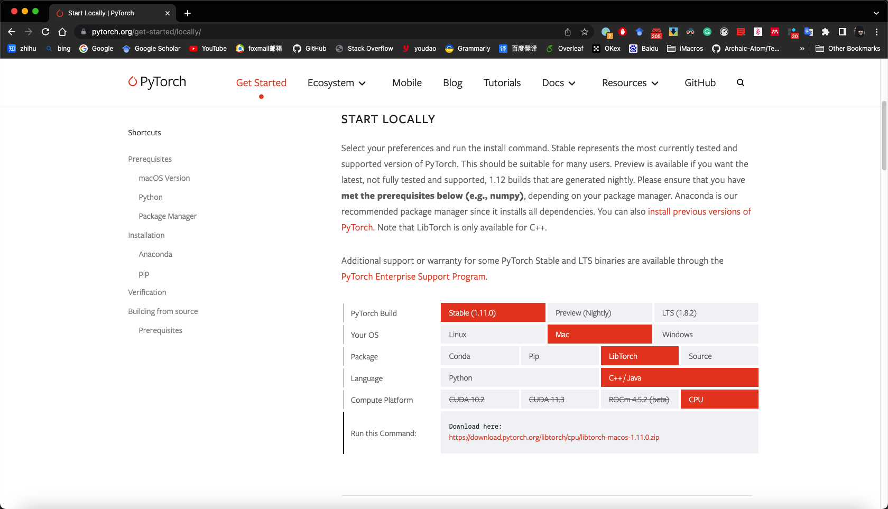

>This is project for matting, which is based on c++

### 1. How to use
#### 1.1 down load pytorch lib

you can find this lib from [Pytorch website](https://pytorch.org/get-started/locally/), and put it into ./3rd folder.


#### 1.2 down load pytorch lib

you can find this lib from [OpenCV website](https://pytorch.org/get-started/locally/), and put it into ./3rd folder.


### 2. Project Structure
```
.
├── 3rd # source code
│   ├── libtorch/
│   └── ...
├── src
│   ├── Test
│   ├── MattingPlugin
│   └── ...
├── LICENSE
├── build.sh
├── clean.sh
├── CMakeLists.txt
└── README.md
```
